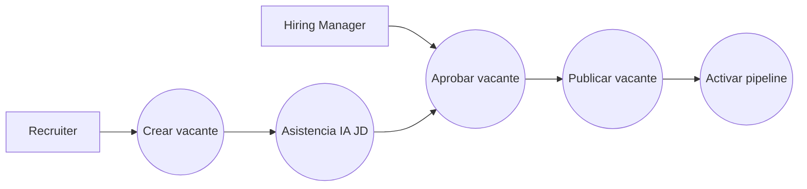
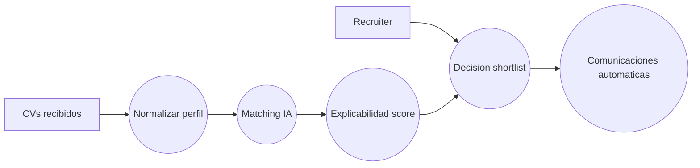
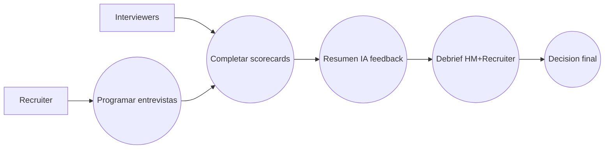
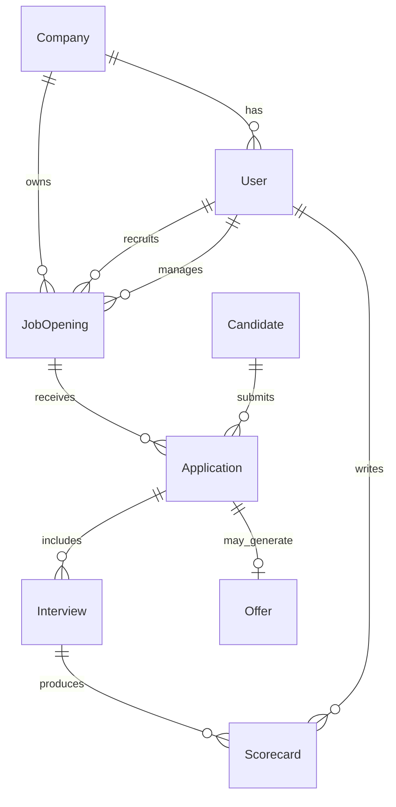
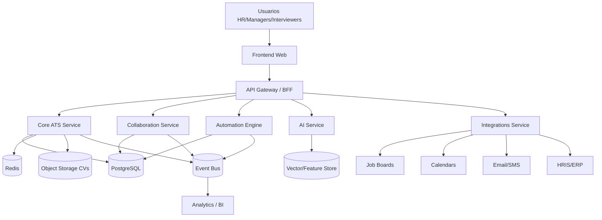
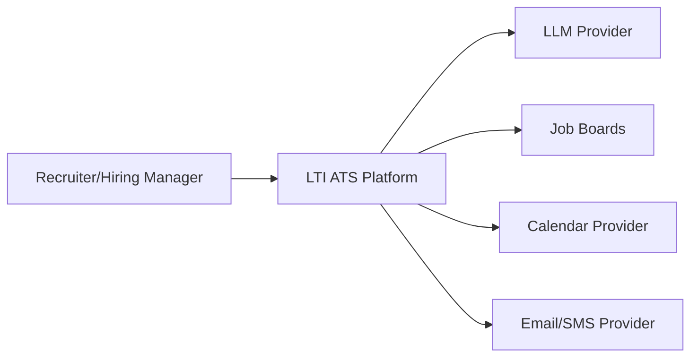
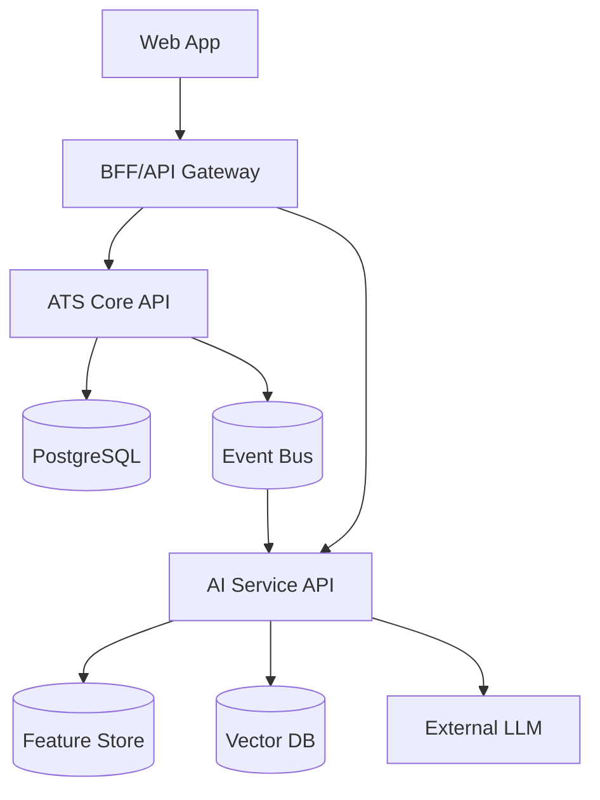
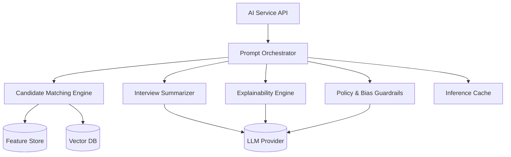

# LTI ATS - Diseño inicial (v1)

## 1) Descripción del software, valor añadido y ventajas competitivas

LTI es una plataforma **ATS (Applicant Tracking System)** centrada en acelerar la contratación de talento con una experiencia colaborativa en tiempo real entre HR, Hiring Managers y entrevistadores. Su objetivo es reducir el tiempo de cobertura de vacantes, mejorar la calidad de contratación y profesionalizar todo el ciclo de selección con automatización e IA aplicada.

### Propuesta de valor
- **Velocidad**: automatiza tareas repetitivas (screening, scheduling, follow-ups, scorecards).
- **Calidad de decisión**: evaluación estructurada, trazabilidad y rankings asistidos por IA.
- **Colaboración real**: feedback sincronizado y paneles compartidos entre áreas.
- **Experiencia candidata**: comunicación proactiva y estado transparente del proceso.

### Ventajas competitivas
- **Copiloto IA nativo** para JD, filtrado inicial, resúmenes de entrevistas y recomendaciones explicables.
- **Motor de automatización no-code** para crear flujos por etapa/rol/país.
- **Sistema de scorecard unificado** para minimizar sesgos y mejorar consistencia.
- **Analítica de embudo en tiempo real** (drop-off, time-to-hire, source quality, SLA por etapa).

### Funciones principales
- Gestión de vacantes y pipeline configurable por proceso.
- Portal de candidatos y centralización de aplicaciones (web, job boards, referidos).
- Matching candidato-vacante con IA (skills, experiencia, seniority, fit contextual).
- Planificación de entrevistas con integraciones de calendario.
- Evaluación colaborativa con scorecards y comentarios en tiempo real.
- Automatizaciones de comunicación (email/SMS/plantillas/eventos).
- Reportes operativos y estratégicos para HR y negocio.

## 2) Lean Canvas (diagrama)

```mermaid
flowchart TB
    A[Problema<br/>- Procesos lentos<br/>- Mala coordinación HR/Managers<br/>- Decisiones con baja trazabilidad]
    B[Segmentos de clientes<br/>- Startups 20-500 empleados<br/>- Scaleups en crecimiento<br/>- Equipos HR con alto volumen]
    C[Propuesta única de valor<br/>ATS colaborativo + IA explicable + automatización no-code]
    D[Solución<br/>- Pipeline inteligente<br/>- Copiloto IA<br/>- Scorecards estructurados<br/>- Automatizaciones omnicanal]
    E[Canales<br/>- Ventas B2B SaaS<br/>- Partners HR Tech<br/>- Content/SEO<br/>- Product-led demos]
    F[Fuentes de ingreso<br/>- Suscripción por asiento<br/>- Add-ons IA<br/>- Plan Enterprise]
    G[Estructura de costes<br/>- Infra cloud<br/>- Coste IA (tokens/modelos)<br/>- Producto e ingeniería<br/>- Ventas y soporte]
    H[Métricas clave<br/>- Time-to-hire<br/>- Conversion por etapa<br/>- Calidad de contratación<br/>- Adopción por hiring managers]
    I[Ventaja injusta<br/>- Data model propio de contratación<br/>- Loops de aprendizaje de decisiones<br/>- UX enfocada en colaboración]

    A --> C
    B --> C
    C --> D
    D --> H
    E --> B
    F --> G
    I --> C
```

## 3) Casos de uso principales (3)

### Caso de uso 1: Publicar vacante y activar pipeline
**Actores**: Recruiter (primario), Hiring Manager (secundario).  
**Objetivo**: crear vacante aprobada y comenzar captación.  
**Precondición**: plantilla de proceso y permisos activos.

**Flujo principal**
1. Recruiter crea vacante desde plantilla.
2. IA sugiere mejoras de JD (claridad, skills, seniority, sesgos de lenguaje).
3. Hiring Manager revisa y aprueba.
4. Sistema publica en career site y job boards conectados.
5. Se activa pipeline y SLA por etapa.

**Alternos/excepciones**
- A1: vacante rechazada -> vuelve a borrador con comentarios.
- A2: falta presupuesto/aprobación -> estado "On Hold".



### Caso de uso 2: Screening y shortlist asistidos por IA
**Actores**: Recruiter.  
**Objetivo**: priorizar candidatos y generar shortlist con criterios trazables.  
**Precondición**: candidatos aplicados y CVs parseados.

**Flujo principal**
1. Sistema parsea CV y normaliza skills/experiencia.
2. Motor IA calcula score de ajuste por vacante.
3. Recruiter revisa explicación del score.
4. Recruiter etiqueta candidatos (avanzar, reserva, descartar).
5. Sistema notifica automáticamente según resultado.

**Alternos/excepciones**
- B1: score ambiguo -> se solicita revisión manual obligatoria.
- B2: falta información de CV -> se solicita formulario adicional al candidato.



### Caso de uso 3: Entrevistas colaborativas y decisión final
**Actores**: Recruiter, Interviewers, Hiring Manager.  
**Objetivo**: consolidar feedback estructurado y decidir oferta/rechazo.  
**Precondición**: candidato en etapa de entrevistas.

**Flujo principal**
1. Recruiter programa panel de entrevistas con calendario integrado.
2. Interviewers completan scorecards estructuradas.
3. IA resume feedback y detecta inconsistencias.
4. Hiring Manager y Recruiter realizan debrief.
5. Se registra decisión final y se ejecuta flujo de oferta/rechazo.

**Alternos/excepciones**
- C1: scorecards incompletas -> bloqueo de decisión hasta completar.
- C2: empate o desacuerdo -> ronda extra de entrevista.



## 4) Modelo de datos

### Entidades y atributos (nombre y tipo)

**Company**
- id: UUID
- name: String
- industry: String
- size_range: String
- created_at: DateTime

**User**
- id: UUID
- company_id: UUID
- full_name: String
- email: String
- role: Enum(ADMIN, RECRUITER, HIRING_MANAGER, INTERVIEWER)
- status: Enum(ACTIVE, INACTIVE)
- created_at: DateTime

**JobOpening**
- id: UUID
- company_id: UUID
- hiring_manager_id: UUID
- recruiter_id: UUID
- title: String
- department: String
- location: String
- employment_type: Enum(FULL_TIME, PART_TIME, CONTRACT)
- description: Text
- status: Enum(DRAFT, APPROVAL, OPEN, ON_HOLD, CLOSED)
- opened_at: DateTime

**Application**
- id: UUID
- job_opening_id: UUID
- candidate_id: UUID
- source: Enum(CAREER_SITE, JOB_BOARD, REFERRAL, AGENCY)
- stage: Enum(APPLIED, SCREENING, INTERVIEW, OFFER, HIRED, REJECTED)
- ai_match_score: Decimal(5,2)
- applied_at: DateTime

**Candidate**
- id: UUID
- full_name: String
- email: String
- phone: String
- linkedin_url: String
- resume_url: String
- years_experience: Int
- current_location: String
- created_at: DateTime

**Interview**
- id: UUID
- application_id: UUID
- type: Enum(PHONE, TECHNICAL, CULTURE, MANAGER)
- scheduled_start: DateTime
- scheduled_end: DateTime
- meeting_url: String
- status: Enum(SCHEDULED, COMPLETED, CANCELLED)

**Scorecard**
- id: UUID
- interview_id: UUID
- interviewer_id: UUID
- technical_score: Int
- communication_score: Int
- culture_score: Int
- recommendation: Enum(STRONG_YES, YES, NO, STRONG_NO)
- notes: Text
- submitted_at: DateTime

**Offer**
- id: UUID
- application_id: UUID
- status: Enum(DRAFT, SENT, ACCEPTED, DECLINED)
- salary_amount: Decimal(12,2)
- currency: String(3)
- start_date: Date
- created_at: DateTime

### Relaciones (ER)



## 5) Diseño de sistema de alto nivel

Arquitectura orientada a dominio con backend modular, eventos de negocio y servicios especializados para IA y automatización.

### Explicación
- **Frontend Web** para Recruiters/Hiring Managers/Interviewers (SPA).
- **API Gateway + BFF** para autenticación, autorización y composición de datos.
- **Core ATS Service** gestiona vacantes, candidaturas, etapas y reglas de negocio.
- **Collaboration Service** centraliza feedback, scorecards y debriefs en tiempo real.
- **Automation Engine** ejecuta workflows disparados por eventos (etapa cambiada, entrevista completada).
- **AI Service** ofrece matching, redacción asistida y resúmenes explicables.
- **Integrations Service** conecta job boards, correo, calendarios y HRIS.
- **Data Layer** con PostgreSQL transaccional + Redis caché + almacenamiento de documentos.
- **Analytics Pipeline** para KPIs operativos en near real-time.



## 6) Diagrama C4 (profundidad en componente elegido)

Componente elegido: **AI Service (Matching & Copilot)**

### C4 - Nivel 1 (Contexto)


### C4 - Nivel 2 (Contenedores)


### C4 - Nivel 3 (Componentes internos del AI Service)


### Decisiones de diseño para este componente
- Arquitectura con **guardrails** para controlar sesgos, PII y cumplimiento.
- **Explicabilidad** obligatoria para cualquier score recomendado.
- Caching de inferencias para reducir coste y latencia.
- Desacoplamiento por eventos para re-entrenamientos y mejora continua.

## 7) Suposiciones y alcance de la v1
- Multi-tenant B2B SaaS con aislamiento lógico por `company_id`.
- Cumplimiento básico RGPD (consentimiento y retención configurable).
- Sin nómina ni onboarding avanzado en v1 (integración posterior con HRIS).
- IA como asistente de recomendación, no como decisor final automático.
